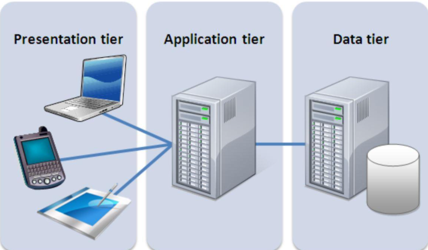

### **WEB SOLUTION WITH WORDPRESS**

In this project you will be tasked to prepare storage infrastructure on two Linux servers and implement a basic web solution using **WordPress**  . WordPress is a free and open-source content management system written in **PHP** 
 and paired with **MySQL**    or **MariaDB**    as its backend Relational Database Management System (RDBMS).

**This Project consist of two parts:**

1. Configure storage subsystem for Web and Database servers based on Linux OS. The focus of this part is to give you practical experience of working with disks, partitions and volumes in Linux.

2. Install WordPress and connect it to a remote MySQL database server. This part of the project will solidify your skills of deploying Web and DB tiers of Web solution.

**Three-tier Architecture**

**Three-tier Architecture** is a client-server software architecture pattern that comprise of 3 separate layers.



**Presentation Layer (PL):** This is the user interface such as the client server or browser on your laptop.

**Business Layer (BL):** This is the backend program that implements business logic. Application or Webserver

**Data Access or Management Layer (DAL):** This is the layer for computer data storage and data access.

*In previous projects we used ‘Ubuntu’, but it is better to be well-versed with various Linux distributions, thus, for this projects we will use very popular distribution called ‘RedHat’ (it also has a fully compatible derivative – CentOS)*

***Note:** for Ubuntu server, when connecting to it via SSH/Putty or any other tool, we used ubuntu user, but for RedHat you will need to use `ec2-user`. Connection string will look like `ec2-user@<Public-IP>`. Let us get started!*

#### **STEP 1 - PREPARE A WEB-SERVER**
- Launch an EC2 instance that will serve as "Web Server" using RedHat as your OS. Create 3 volumes in the same AZ as your Web Server EC2, each of 10 GiB.

**Note:** The EBS created must be named as: `/dev/xvdf, /dev/xvdg, /dev/xvdh.`


- Open up the Linux terminal and SSH to begin configuration.

- Use `lsblk` command to inspect what block devices are attached to the server.


- Notice names of your newly created devices. All devices in Linux reside in /dev/ directory. Inspect it with `ls /dev/` and make sure you see all 3 newly created block devices there – their names will likely be xvdf, xvdh, xvdg.


- Use `df -h` command to see all mounts and free space on your server.

- Use `fdisk` utility to create a single partition on each of the 3 disks `sudo fdisk /dev/xvdf`, `sudo fdisk /dev/xvdg`, and `sudo fdisk /dev/xvdh`... follow the step in the image below to create the other disk.


- Use `lsblk` utility to view the newly configured partition on each of the 3 disks.


- Install lvm2 package using `sudo yum install lvm2`

- Run `sudo lvmdiskscan` command to check for available partitions.

- Use `pvcreate` utility to mark each of 3 disks as physical volumes (PVs) to be used by LVM.

```sudo pvcreate /dev/xvdf1
sudo pvcreate /dev/xvdg1
sudo pvcreate /dev/xvdh1
```

- Verify that your Physical volume has been created successfully by running `sudo pvs`.

- Use `vgcreate` utility to add all 3 PVs to a volume group (VG). Name the VG webdata-vg.

`sudo vgcreate webdata-vg /dev/xvdh1 /dev/xvdg1 /dev/xvdf1`

- Verify that your VG has been created successfully by running `sudo vgs`.

Use `lvcreate` utility to create 2 logical volumes. apps-lv (Use half of the PV size), and logs-lv Use the remaining space of the PV size.

**NOTE:** apps-lv will be used to store data for the Website while, logs-lv will be used to store data for logs.

`sudo lvcreate -n apps-lv -L 14G webdata-vg`

`sudo lvcreate -n logs-lv -L 14G webdata-vg`

- Verify that your Logical Volume has been created successfully by running `sudo lvs`.


- Verify the entire setup

`sudo vgdisplay -v #view complete setup - VG, PV, and LV`


- `sudo lsblk`


- Use mkfs.ext4 to format the logical volumes with ext4 filesystem

`sudo mkfs -t ext4 /dev/webdata-vg/apps-lv`, 
`sudo mkfs -t ext4 /dev/webdata-vg/logs-lv`


- Create /var/www/html directory to store website files

`sudo mkdir -p /var/www/html`

- Create /home/recovery/logs to store backup of log data.

`sudo mkdir -p /home/recovery/logs`

- Mount /var/www/html on apps-lv logical volume

`sudo mount /dev/webdata-vg/apps-lv /var/www/html/`

- Use `rsync` utility to back up all the files in the log directory /var/log into /home/recovery/logs (This is required before mounting the file system)

`sudo rsync -av /var/log/. /home/recovery/logs/`


- Mount /var/log on logs-lv logical volume. (Note that all the existing data on /var/log will be deleted. That is why step 15 above is very important).

`sudo mount /dev/webdata-vg/logs-lv /var/log`

- Restore log files back into /var/log directory

`sudo rsync -av /home/recovery/logs/. /var/log`


- Update /etc/fstab file so that the mount configuration will persist after restart of the server.

- The UUID of the device will be used to update the /etc/fstab file; `sudo blkid`


- Update /etc/fstab in this format using your own UUID and rememeber to remove the leading and ending quotes.

`sudo vi /etc/fstab`


- Test the configuration and reload the daemon

`sudo systemctl daemon-reload`

- Verify your setup by running `df -h`, output must look like this:


#### **STEP 2 - PREPARE THE DATABASE SERVER.**

- Launch a second RedHat EC2 instance that will have a role – ‘DB Server’ Repeat the same steps as for the Web Server, but instead of apps-lv and logs-lv, create db-lv and logs-lv, then mount it to /db directory instead of /var/www/html/.

#### **STEP 3 - INSTALL WORDPRESS ON YOUR WEBSERVER EC2.**

- Update the repository `sudo yum -y update`


- Install wget, Apache and it's dependencies:

`sudo yum -y install wget httpd php php-mysqlnd php-fpm php-json`


- Start Apache: `sudo systemctl enable httpd sudo systemctl start httpd`

- To install PHP and its dependencies:

``` sudo yum install https://dl.fedoraproject.org/pub/epel/epel-release-latest-8.noarch.rpm
sudo yum install yum-utils http://rpms.remirepo.net/enterprise/remi-release-8.rpm
sudo yum module list php
sudo yum module reset php
sudo yum module enable php:remi-7.4
sudo yum install php php-opcache php-gd php-curl php-mysqlnd
sudo systemctl start php-fpm
sudo systemctl enable php-fpm
setsebool -P httpd_execmem 1
```


- Restart Apache: `sudo systemctl restart httpd`

- Download wordpress and copy wordpress to **var/www/html:**

```mkdir wordpress
cd   wordpress
sudo wget http://wordpress.org/latest.tar.gz
sudo tar xzvf latest.tar.gz
sudo rm -rf latest.tar.gz
cp wordpress/wp-config-sample.php wordpress/wp-config.php
cp -R wordpress /var/www/html/
```


- Configure SELinux Policies:

```sudo chown -R apache:apache /var/www/html/wordpress
sudo chcon -t httpd_sys_rw_content_t /var/www/html/wordpress -R
sudo setsebool -P httpd_can_network_connect=1
 sudo setsebool -P httpd_can_network_connect_db 1
 ```

 #### **STEP 4 - INSTALL MySQL ON YOUR DB SERVER EC2.**

 - sudo yum update

- Verify that the service is up and running by using: `sudo systemctl status mariadb`

- if it is not running, restart the service and enable it so it will be running even after reboot:

`sudo systemctl restart mariabd`, `sudo systemctl enable mariadb`


#### **STEP 5 - CONFIGURE DB TO WORK WITH WORDPESS.**

 ```
 sudo mysql
CREATE DATABASE wordpress;
CREATE USER `myuser`@`<Web-Server-Private-IP-Address>` IDENTIFIED BY 'mypass';
GRANT ALL ON wordpress.* TO 'myuser'@'<Web-Server-Private-IP-Address>';
FLUSH PRIVILEGES;
SHOW DATABASES;
exit
```


#### **STEP 6 - CONFIGURE WORDPRESS TO CONNECT TO THE REMOTE DATABASE.**

- Hint: Do not forget to open MySQL port 3306 on DB Server EC2. For extra security, you shall allow access to the DB server ONLY from your Web Server’s IP address, so in the Inbound Rule configuration specify source as /32


- Install MySQL client and test that you can connect from your Web Server to your DB server by using mariadb-client `sudo yum install mariadb -y`

- Allow Remote Database Connections Edit MariaDB configuration on your DB SERVER: `sudo nano /etc/my.cnf.d/mariadb-server.cnf`

- Change blind address to bind-address=0.0.0.0


- Restart MariaDB: `sudo systemctl restart mariadb`

`sudo systemctl status mariadb`

- **Note:** Make sure your DB Server security group has port 3306 open and type will be **MySQL/Auora** as seen previously in the image above.

- Confirm MariaDB Is Listening on Port 3306 On the DB Server: `sudo ss -tlnp | grep 3306`


- Restart MariaDB again: `sudo systemctl restart mariadb`

- Then go back to the Web Server: `mysql -h DB_SERVER_PRIVATE_IP -u myuser -p`

- Then type your password

- Then Type `SHOW DATABASES;`


- Try to access from your browser the link to your WordPress `http://<Web-Server-Public-IP-Address>/wordpress/`

- Fill in all the required informations when prompted.


